# 从零理解 WorldQuant BRAIN 平台与 Fast Expression 语言

> **阅读对象**：没有量化金融背景、刚接触 BRAIN 平台的新手  
> **核心目标**：彻底搞懂"FE 表达式到底在处理什么数据、怎么处理、最终得到什么结果"  
> **配套图表**：本文所有图表均由 `scripts/generate_learning_charts.py` 自动生成，存放于 `docs/img/`

---

## 目录

1. [BRAIN 平台是什么？——用一句话理解](#1-brain-平台是什么)
2. [数据的本质：全是"矩阵"](#2-数据的本质全是矩阵)
3. [五大数据集：平台里有什么可以用的](#3-五大数据集)
4. [Fast Expression 的本质：矩阵变换管道](#4-fast-expression-的本质)
5. [截面运算符详解：rank / group_rank / normalize](#5-截面运算符详解)
6. [时序运算符详解：ts_rank / ts_mean / ts_delta](#6-时序运算符详解)
7. [信号 → 持仓权重 → PnL：完整流程](#7-信号到持仓权重到pnl)
8. [模拟设置详解：decay / neutralization / truncation](#8-模拟设置详解)
9. [Fitness 公式：决定能否提交的核心指标](#9-fitness-公式)
10. [实战演示：逐步构建一个通过的 Alpha](#10-实战演示)
11. [常见问题与误区](#11-常见问题与误区)
12. [快速参考卡片](#12-快速参考卡片)

---

## 1. BRAIN 平台是什么？

**一句话**：WorldQuant BRAIN 是一个让你"写公式 → 自动回测 → 看结果"的量化选股平台。

### 你在做什么？

你的工作是写一个 **Alpha 表达式**，告诉系统："请按照我这个公式，给美股 TOP3000 的每只股票打一个分，然后高分买、低分卖，看看这个策略过去5年能赚多少钱、Sharpe 比率多少。"

### 流程示意

```
你写一个公式
    ↓
BRAIN 平台每天给 3000 只股票各自计算一个分数
    ↓
按分数构建多空组合（高分做多 / 低分做空）
    ↓
模拟过去5年的交易，统计收益/风险指标
    ↓
返回 Sharpe、Fitness、Turnover 等指标
    ↓
如果指标好（Sharpe≥1.25, Fitness≥1.0），可以提交！
```

---

## 2. 数据的本质：全是"矩阵"

### 2.1 最重要的思维模型

**BRAIN 平台里所有数据，都是一张"日期 × 股票"的二维表（矩阵）。**

- **行** = 某一天（2019-01-02、2019-01-03……）
- **列** = 某只股票（AAPL、MSFT、GOOGL……）
- **格子里的值** = 那一天那只股票的某个数字

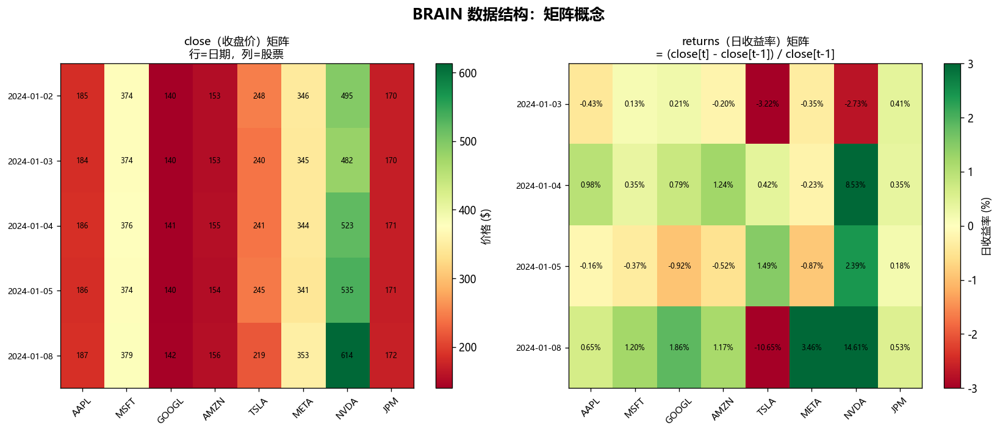

上图左侧是 `close`（收盘价）矩阵，右侧是 `returns`（日收益率）矩阵。每种数据都是这样的一张表。

### 2.2 常见数据字段

| 字段名 | 含义 | 更新频率 | 数值范围举例 |
|--------|------|----------|------------|
| `close` | 当日收盘价 | 每日 | 10~5000 ($) |
| `returns` | 日收益率 | 每日 | -0.10 ~ +0.10 |
| `volume` | 成交量（股数） | 每日 | 百万 ~ 十亿 |
| `assets` | 总资产（美元） | 每季度 | 十亿 ~ 万亿 |
| `operating_income` | 营业利润 | 每季度 | 亿 ~ 千亿 |
| `equity` | 股东权益 | 每季度 | 亿 ~ 万亿 |
| `scl12_buzz` | 新闻/社媒声量 | 每日 | 0 ~ 5+（相对值） |

### 2.3 数据的"时间粒度"很重要

```
基本面数据（assets, sales, operating_income 等）：
  每季度更新一次 → 连续90天的值相同 → 换手率天然极低（1-5%）

价格/量数据（close, returns, volume）：
  每日更新 → 每天都不同 → 换手率高（30-80%）

情绪/新闻数据（scl12_buzz, snt1_*）：
  每日更新，但信号较嘈杂 → 换手率中等（15-40%）
```

---

## 3. 五大数据集

BRAIN 平台提供约 **2663 个**数据字段，分成五大类：

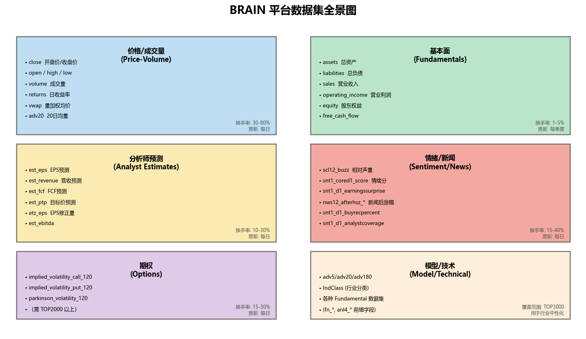

### 3.1 价格/量（Price-Volume）

**是什么**：股票每天的交易数据，最基础的数据。

```
close    → 收盘价（最常用）
open     → 开盘价
high/low → 最高/最低价
volume   → 成交量（股数）
vwap     → 成交量加权均价（Volume Weighted Average Price）
returns  → 日收益率 = (close[t] - close[t-1]) / close[t-1]
adv20    → 过去20日平均成交量
```

**用途**：动量、成交量异常、价格模式等技术类策略。  
**缺点**：同质化严重，被过度挖掘，新 Alpha 很难通过。

### 3.2 基本面（Fundamentals）

**是什么**：公司财务报告里的数字，每季度更新。

```
assets           → 总资产
liabilities      → 总负债
equity           → 股东权益（= assets - liabilities）
sales            → 营业收入
operating_income → 营业利润
cashflow         → 经营现金流
```

**关键公式**：

$$\text{ROE 代理} = \frac{\text{operating\_income}}{\text{equity}}$$

$$\text{杠杆率} = \frac{\text{liabilities}}{\text{assets}}$$

**用途**：价值因子、成长因子、质量因子。  
**优点**：换手率极低（<5%），天然满足 Fitness 要求。

### 3.3 分析师预测（Analyst Estimates）

**是什么**：华尔街分析师对未来的预测值（每日更新，反映最新共识）。

```
est_eps      → EPS 预测（每股收益）
est_revenue  → 营收预测
est_fcf      → 自由现金流预测
est_ptp      → 税前利润预测
etz_eps      → EPS 预测修正量（analysts 最近是调高还是调低）
```

**关键逻辑**：分析师上调预期 → 市场往往滞后 → 股价后续跟涨（Revision Effect）

```
Alpha 示例: rank(etz_eps / est_eps)  ← 最近预测修正幅度
```

### 3.4 情绪/新闻（Sentiment/News）

**是什么**：对新闻、社交媒体的 AI 解读，量化成情绪分。

```
scl12_buzz           → 相对媒体声量（和自己历史相比）
snt1_cored1_score    → 核心情绪评分（-1 到 +1）
snt1_d1_earningssurprise → 盈利惊喜情绪
snt1_d1_buyrecpercent    → 分析师买入评级占比
nws12_afterhsz_*         → 新闻发布后的股价表现
```

**《The Momentum of News》论文关键发现**：  
好消息股票倾向于持续获得好消息（基本面持续性），形成新闻动量效应。

```
Alpha 示例: rank(-ts_std_dev(scl12_buzz, 18))  ← 声量稳定的股票做多
```

### 3.5 期权（Options）

**是什么**：期权市场数据，反映市场对未来波动的预期。

```
implied_volatility_call_120  → 120日看涨期权隐含波动率
implied_volatility_put_120   → 120日看跌期权隐含波动率
parkinson_volatility_120     → 120日 Parkinson 历史波动率
```

**关键逻辑**：隐含波动率 > 历史波动率 → 市场恐慌 → 可能反向做多（波动率均值回归）

---

## 4. Fast Expression 的本质

### 4.1 "不是代码，是表达式"——这才是关键

很多人（包括有编程经验的人）刚开始学 FE 时都有一个误区：

> ❌ 错误理解："这是一段代码，它会循环遍历股票，然后计算每只股票的得分"  
> ✅ 正确理解："这是一个数学公式，它描述了如何对**整张矩阵**进行变换"

FE 表达式的每一步，都是对整张"3000行（股票）× 时序"矩阵的一次数学变换。

### 4.2 完整处理流水线示意

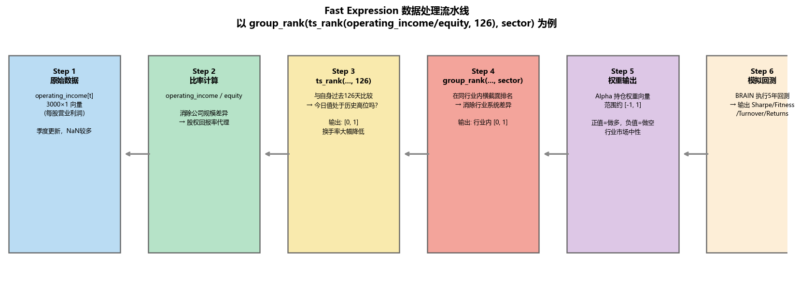

以 `group_rank(ts_rank(operating_income/equity, 126), sector)` 为例：

| 步骤 | 操作 | 输入 | 输出 | 说明 |
|------|------|------|------|------|
| 1 | 读取原始数据 | — | 3000×1 向量 | `operating_income` 当天各股值 |
| 2 | 比率计算 | `operating_income`, `equity` | 3000×1 | 消除公司规模差异 |
| 3 | `ts_rank(..., 126)` | 3000 支股票的过去126天 | 3000×1 ∈[0,1] | 纵向时间比较：今天好不好？ |
| 4 | `group_rank(..., sector)` | 按行业分组的 3000×1 | 3000×1 ∈[0,1] | 横向行业内排名：同行里排第几？ |
| 5 | BRAIN 将结果映射为持仓权重 | — | 多空组合 | 高分做多，低分做空 |
| 6 | 5年回测 | — | Sharpe/Fitness | 统计指标 |

### 4.3 表达式的语法规则

```
# 基本算术
operating_income / equity          ← 除法（逐元素）
assets - liabilities               ← 减法
close * volume                     ← 乘法

# 截面运算符（在同一天，3000只股票之间比较）
rank(x)                            ← 截面百分位 [0,1]
group_rank(x, sector)              ← 行业内百分位 [0,1]
zscore(x)                          ← 截面 z-score

# 时序运算符（一只股票，在过去d天内计算）
ts_rank(x, d)                      ← 时序百分位 [0,1]
ts_mean(x, d)                      ← 过去d天均值
ts_std_dev(x, d)                   ← 过去d天标准差
ts_delta(x, d)                     ← x[t] - x[t-d]
ts_corr(x, y, d)                   ← 过去d天x,y的相关系数

# 复合嵌套（推荐模式）
group_rank(ts_rank(x, 126), sector)  ← 先时序后截面
rank(-ts_std_dev(scl12_buzz, 18))    ← 先时序后截面
```

---

## 5. 截面运算符详解

### 5.1 rank() ——核心中的核心

`rank(x)` 的作用：**在同一天，把 3000 只股票的某个指标，转换为 0~1 之间的均匀分布排名。**

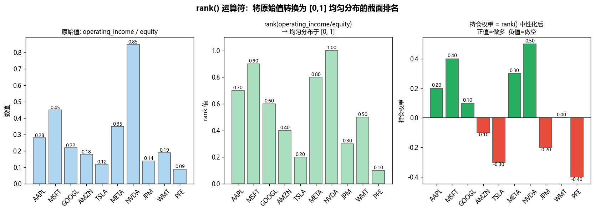

**三步理解**：
1. 第一张图：原始的 `operating_income/equity`，范围从 0.09 到 0.85，分布不均匀
2. 第二张图：`rank()` 后，所有值均匀分布在 [0,1]，最小变 0，最大变 1
3. 第三张图：`rank() - 0.5`（或 BRAIN 自动做的中性化），高于中位的做多（绿），低于的做空（红）

**为什么一定要 rank()**：
- 原始值 NVDA=0.85、TSLA=0.12，量纲不统一，无法直接作为权重
- rank 后统一为 [0,1]，才能做有意义的多空排名
- 消除极端值的影响（一家公司利润特别高不会无限拉大权重）

### 5.2 group_rank() ——行业内中性化

`group_rank(x, sector)` 在行业内各自排名。

**关键区别**：
```
rank(operating_income/equity)
  → 把科技/金融/能源所有公司放一起排名
  → Alpha 会集中持有科技股（因为科技公司ROE普遍高）
  → 有行业集中风险！

group_rank(operating_income/equity, sector)
  → 在每个行业内单独排名
  → 每个行业都有做多/做空标的
  → 行业风险消除，只保留行业内相对因子
```

**group 参数选项**：
```
sector      → 11个大行业（科技/医疗/金融等）
industry    → 约68个行业
subindustry → 约160个子行业（最细，但覆盖度低）
market      → 相当于 rank()（全市场，不分组）
```

---

## 6. 时序运算符详解

### 6.1 三大核心时序算子

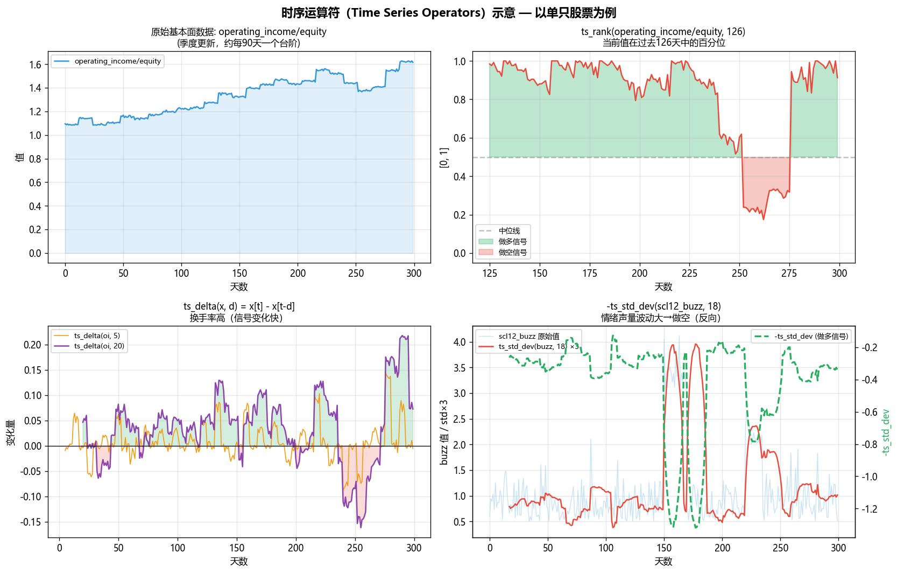

#### ts_rank(x, d) — 时序版的 rank

**含义**：今天的值，在过去d天中排第几名（百分位）

```python
# 概念等价代码（不是 FE 语法）：
for each stock i:
    history = [x[t-d+1], x[t-d+2], ..., x[t]]  # 过去d天的值
    ts_rank[i][t] = rank of x[t] within history  # 在历史中的百分位
```

**为什么用 ts_rank 而不是直接用原始值**：
- 基本面数据季度更新，长期上升趋势，原始值大不代表好
- ts_rank 问的是"相对自身历史，今天好不好"，更有意义
- 实测：`ts_rank(operating_income/equity, 126)` 比直接用 `operating_income/equity` 效果好得多

#### ts_delta(x, d) — 变化量

**含义**：`x[t] - x[t-d]`，过去d天的变化

```
ts_delta(close, 5)   ← 5天价格变化（短期动量）
ts_delta(assets, 63) ← 季度资产变化（成长信号）
```

**注意**：换手率高，因为每天差值都在变。

#### ts_std_dev(x, d) — 波动率

**含义**：过去d天的标准差，衡量波动性

```
ts_std_dev(returns, 20)  ← 20日历史波动率
-ts_std_dev(scl12_buzz, 18)  ← 声量稳定 → 做多（反向）
```

### 6.2 窗口长度选择指南

| 数据类型 | 推荐窗口 | 原因 |
|---------|---------|------|
| 基本面（季度更新）| 63~252天 | 窗口需覆盖1~4个季度 |
| 价格/量（日更新）| 5~60天 | 窗口过长则信号腐化 |
| 情绪/新闻 | 10~30天 | 新闻效应半衰期约2周 |

---

## 7. 信号到持仓权重到PnL

### 7.1 Alpha 如何变成钱

```
Step 1: 你的公式每天给 3000 只股票打分
        score_AAPL=0.87, score_MSFT=0.92, ..., score_XOM=0.21

Step 2: BRAIN 将分数排名后中性化
        weight_i = score_i - mean(all_scores)  ← 大约 [-0.5, +0.5]

Step 3: 按权重买卖
        weight > 0 → 做多（买入这只股票）
        weight < 0 → 做空（卖空这只股票）

Step 4: 第二天重新计算，调整持仓
        换手率 = 每天调整的仓位量

Step 5: 累加5年的每日盈亏 → 得到 PnL 曲线
```

### 7.2 三类 Alpha 的 PnL 对比

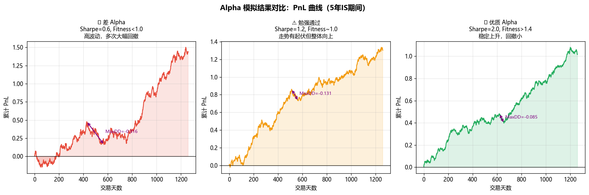

| 类别 | Sharpe | 特征 | 原因 |
|------|--------|------|------|
| 差 Alpha | < 1.0 | 大幅回撤，方向不稳 | 信号没有预测力 |
| 中等 | 1.2~1.5 | 整体向上但有波折 | 信号有一定预测力 |
| 优质 | > 1.8 | 稳定上升，回撤小 | 信号持续有效 |

### 7.3 实测最佳 Alpha 之一

```
group_rank(ts_rank(operating_income/equity, 126), sector)
```

- **Sharpe = 2.07，Fitness = 1.45**
- 换手率仅 6.7%（基本面季度更新，持仓非常稳定）
- 解读："在同行业中，ROE 处于历史高位的公司，做多"

---

## 8. 模拟设置详解

模拟设置决定了 BRAIN 如何"运行"你的 Alpha，对结果影响很大。

### 8.1 默认设置

```python
{
    "instrumentType": "EQUITY",     # 股票
    "region": "USA",                 # 美股
    "universe": "TOP3000",           # 市值前3000只
    "delay": 1,                      # 延迟1天（避免未来函数）
    "decay": 4,                      # 4日线性衰减
    "neutralization": "MARKET",      # 市场中性
    "truncation": 0.05,              # 最大持仓5%
    "pasteurization": "ON",          # 数据清洗
    "nanHandling": "OFF",            # NaN 处理
    "language": "FASTEXPR"
}
```

### 8.2 Decay（衰减）

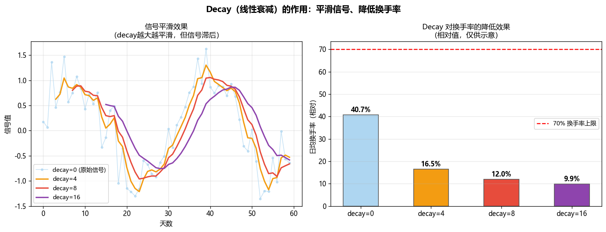

`decay=N` 的效果是对过去N天的信号做**线性加权平均**：

$$\text{decayed}[t] = \frac{N \cdot x[t] + (N-1) \cdot x[t-1] + ... + 1 \cdot x[t-N+1]}{N + (N-1) + ... + 1}$$

| decay 值 | 适用场景 | 换手率影响 |
|---------|---------|----------|
| 0 | 基本面因子（本身已低换手）| 无 |
| 4 | 默认，平衡速度和稳定性 | 降低约30% |
| 8-16 | 技术/情绪因子（本身换手太高）| 降低约50-70% |

**基本面 Alpha 推荐 `decay=0`**（因为季度数据本身已经很平滑）。

### 8.3 Neutralization（中性化）

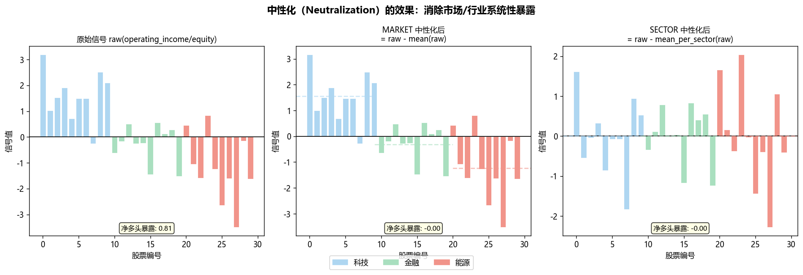

上图展示了原始信号、市场中性化和行业中性化的区别：

| 选项 | 效果 | 净多头暴露 |
|------|------|----------|
| `NONE` | 不中性化，可以有纯多头或纯空头 | 可能很大 |
| `MARKET` | 对全市场中性，Long-Short 对冲 | ≈ 0 |
| `SECTOR` | 对行业中性，每行业内平衡 | ≈ 0（每行业） |
| `INDUSTRY` | 对行业细分中性 | ≈ 0（每行业细分） |
| `SUBINDUSTRY` | 最细粒度 | ≈ 0（每子行业） |

**推荐**：
- 基本面因子 → `SUBINDUSTRY`（消除最多系统风险，提升 Sharpe）
- 技术因子 → `MARKET` 即可（避免过度中性化浪费信号）

### 8.4 Truncation（截断）

`truncation=0.05` 表示单只股票最大权重不超过5%，防止集中持有大盘股。

基本面 Alpha 可提升到 `truncation=0.08`（因为持仓分散，极少触发）。

---

## 9. Fitness 公式

### 9.1 公式

$$\text{Fitness} = \text{Sharpe} \times \sqrt{\frac{|\text{Returns}|}{\max(\text{Turnover}, 0.125)}}$$

### 9.2 核心结论

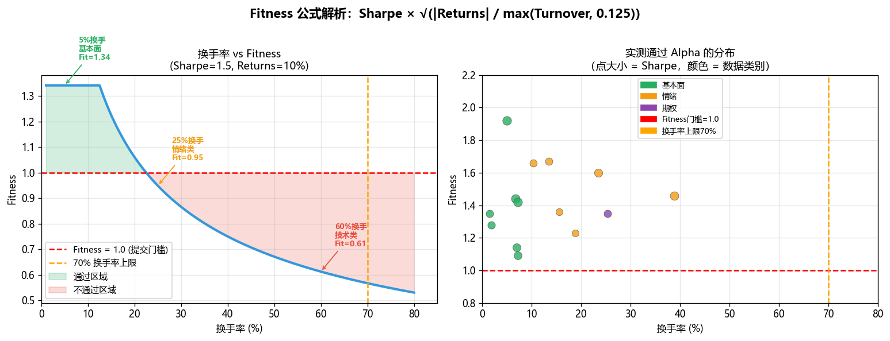

左图展示：固定 Sharpe=1.5，Returns=10%，换手率越低，Fitness 越高。

| 换手率 | Fitness（Sharpe=1.5, Returns=10%）| 判断 |
|--------|--------------------------------|------|
| 5% | 1.89 | ✅ 轻松通过 |
| 12.5% | 1.50 | ✅ 通过（分母收敛点）|
| 25% | 1.06 | ✅ 勉强通过 |
| 50% | 0.75 | ❌ 不通过 |
| 70% | — | ❌ HIGH_TURNOVER 直接拒绝 |

### 9.3 提交门槛

```
Sharpe ≥ 1.25   AND   Fitness ≥ 1.0   AND   1% ≤ Turnover ≤ 70%
```

**实用技巧**：
- 换手率 < 5%（基本面）→ 只要 Sharpe > 0.9 就可能 Fitness > 1.0
- 换手率 30-50%（情绪）→ 需要 Sharpe > 1.6 才能达到 Fitness ≥ 1.0
- 换手率 > 70% → 直接被 `HIGH_TURNOVER` Check 拒绝

---

## 10. 实战演示

### 10.1 参数调优实测数据

以下是真实 API 回测数据（`results/wave9_*.json`）：

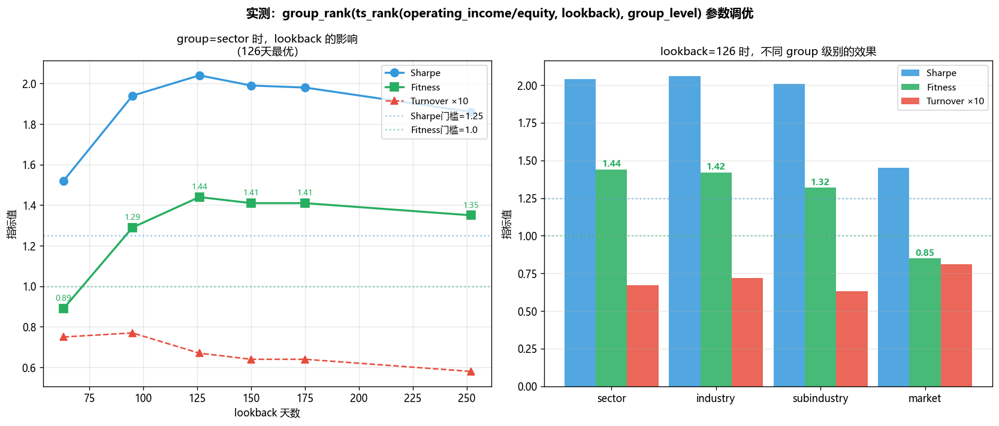

**表达式**: `group_rank(ts_rank(operating_income/equity, LOOKBACK), GROUP)`

#### lookback 参数的影响（固定 sector）

| lookback | Sharpe | Fitness | Turnover |
|---------|--------|---------|---------|
| 63 天 | 1.52 | 0.89 | 7.5% |
| 95 天 | 1.94 | 1.29 | 7.7% |
| **126 天** | **2.04** | **1.44** | **6.7%** |
| 150 天 | 1.99 | 1.41 | 6.4% |
| 175 天 | 1.98 | 1.41 | 6.4% |
| 252 天 | 1.86 | 1.35 | 5.8% |

**结论**：126天（约半年=2个完整季度）是最优窗口。

#### group 参数的影响（固定 lookback=126）

| group | Sharpe | Fitness | Turnover |
|-------|--------|---------|---------|
| **sector** | **2.04** | **1.44** | **6.7%** |
| industry | 2.06 | 1.42 | 7.2% |
| subindustry | 2.01 | 1.32 | 6.3% |
| market | 1.45 | 0.85 | 8.1% |

**结论**：`sector` 和 `industry` 效果差不多，都明显优于 `market`。

### 10.2 实测最高 Fitness 的 Alpha

```
rank(ts_rank(operating_income/equity, 126)) + rank(-equity/assets)
```

- **Sharpe = 2.09，Fitness = 1.92，Turnover = 5.0%**
- **设置**：decay=0, neutralization=SUBINDUSTRY, truncation=0.08
- **解读**：多因子叠加（ROE高位 + 杠杆率低）

### 10.3 策略 × 数据类型成功率热图

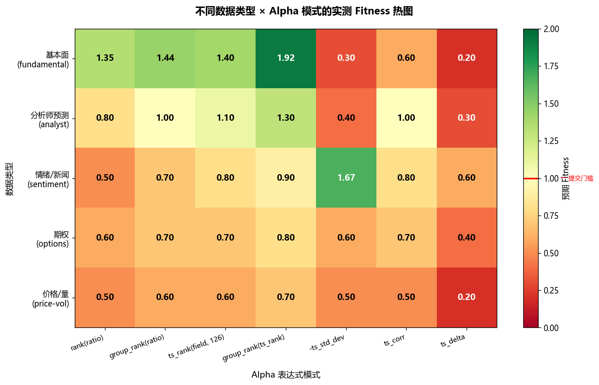

**核心结论**：
- 基本面数据 + `group_rank(ts_rank())` 组合 → 最高 Fitness（实测 1.92）
- 情绪数据 + `-ts_std_dev()` → 不错（Fitness~1.67）
- 纯价格/量数据 + 任何模式 → 很难通过

### 10.4 完整工作流

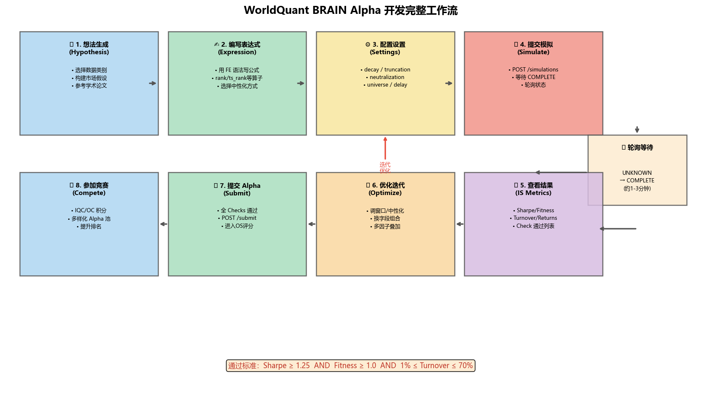

---

## 11. 常见问题与误区

### Q1：FE 表达式里能写 if/for 吗？

不能写传统代码逻辑，但可以用 `if_else(condition, x, y)`：

```
if_else(operating_income > 0, rank(operating_income/equity), -1)
← 如果营业利润为正，用ROE排名；否则空头
```

### Q2：为什么我的 Alpha Sharpe 高但 Fitness 低？

通常是换手率太高。公式：

$$\text{Fitness} = \text{Sharpe} \times \sqrt{\frac{|\text{Returns}|}{\max(\text{TO}, 0.125)}}$$

解决方案：
1. 增加 `decay=8` 或更高平滑信号
2. 换用基本面字段（季度更新，换手率天然低）
3. 用 `hump(x, 0.02)` 限制每日变化量

### Q3：NaN 是什么？怎么处理？

新上市公司、未发布财报的公司，某些字段值为 NaN（缺失值）。

- 默认 `nanHandling=OFF`：NaN 保持为 NaN，不参与计算
- 用 `group_backfill(x, sector)` 用同行业均值填充
- BRAIN 会自动剔除 NaN 股票（不分配权重）

### Q4：Delay 是什么意思？

`delay=1` 表示：计算时用的是**昨天**的数据（不是今天的），确保不"偷看"未来。

现实中，今天收盘后你才能拿到数据，明天才能操作，所以 delay=1 是标准。

### Q5：为什么相同表达式提交两次会得到相同 Alpha ID？

BRAIN 平台会对相同的表达式+设置进行去重，返回已有的 Alpha ID。  
要创建新 Alpha，必须修改表达式或任意设置参数。

### Q6：group_rank 和 group_neutralize 有什么区别？

```
group_rank(x, sector)     → 行业内排名，输出 [0,1]（建议用）
group_neutralize(x, sector) → 减去行业均值，中心化但不标准化
```

大多数场景用 `group_rank` 更稳健。

---

## 12. 快速参考卡片

### 12.1 最佳起点模板

```
# 基本面因子（最容易通过）
group_rank(ts_rank(operating_income/equity, 126), sector)
→ 设置: decay=0, neutralization=SUBINDUSTRY, truncation=0.08

# 情绪因子（中等难度）
rank(-ts_std_dev(scl12_buzz, 18))
→ 设置: decay=4, neutralization=SECTOR, truncation=0.05

# 多因子叠加（进阶）
rank(ts_rank(operating_income/equity, 126)) + rank(-equity/assets)
→ 设置: decay=0, neutralization=SUBINDUSTRY, truncation=0.08
```

### 12.2 运算符速查

| 类别 | 运算符 | 作用 |
|------|--------|------|
| 截面 | `rank(x)` | 全市场百分位 [0,1] |
| 截面 | `group_rank(x, g)` | 分组内百分位 [0,1] |
| 截面 | `zscore(x)` | 全市场 z-score |
| 截面 | `normalize(x)` | 归一化，和为1 |
| 时序 | `ts_rank(x, d)` | 时序百分位 [0,1] |
| 时序 | `ts_mean(x, d)` | d天均值 |
| 时序 | `ts_std_dev(x, d)` | d天标准差 |
| 时序 | `ts_delta(x, d)` | x[t] - x[t-d] |
| 时序 | `ts_corr(x, y, d)` | d天相关系数 |
| 时序 | `ts_decay_linear(x, d)` | 线性衰减平均 |
| 时序 | `ts_delay(x, d)` | x[t-d]（d天前的值）|
| 辅助 | `log(x)` | 自然对数 |
| 辅助 | `sign(x)` | 符号 +1/0/-1 |
| 辅助 | `hump(x, 0.01)` | 限制每日变化量 |

### 12.3 评判标准

| 指标 | 说明 | 提交门槛 |
|------|------|---------|
| Sharpe | 年化超额收益 / 波动率 | ≥ 1.25 |
| Fitness | Sharpe × √(Returns/Turnover) | ≥ 1.0 |
| Turnover | 日均换手比例 | 1% ~ 70% |
| Returns | 年化超额收益率 | 越高越好 |

### 12.4 数据类型 × 换手率预期

| 数据类型 | 典型换手率 | Fitness 难度 |
|---------|----------|------------|
| 基本面（季度）| 1-5% | ⭐ 最容易 |
| 分析师预测 | 10-30% | ⭐⭐ 中等 |
| 情绪/新闻 | 15-40% | ⭐⭐ 中等 |
| 期权 | 15-30% | ⭐⭐ 中等 |
| 价格/量 | 30-80% | ⭐⭐⭐ 困难 |

---

## 附录：代码演示

以下 Python 代码模拟了 FE 表达式的核心运算逻辑（仅供理解，不能在 BRAIN 平台运行）：

```python
import numpy as np
import pandas as pd

# 模拟数据：5天 × 6支股票
operating_income = pd.DataFrame({
    'AAPL': [28e9, 28.5e9, 29e9, 28.8e9, 30e9],
    'MSFT': [22e9, 22.5e9, 23e9, 22.8e9, 24e9],
    'GOOGL': [19e9, 19.5e9, 20e9, 19.8e9, 21e9],
    'AMZN': [3e9, 3.5e9, 4e9, 3.8e9, 5e9],
    'TSLA': [1e9, 1.2e9, 1.5e9, 1.3e9, 1.8e9],
    'META': [10e9, 10.5e9, 11e9, 10.8e9, 12e9],
})
equity = pd.DataFrame({
    'AAPL': [60e9, 60e9, 62e9, 62e9, 63e9],
    'MSFT': [130e9, 130e9, 132e9, 132e9, 134e9],
    'GOOGL': [250e9, 250e9, 255e9, 255e9, 260e9],
    'AMZN': [130e9, 130e9, 135e9, 135e9, 138e9],
    'TSLA': [30e9, 30e9, 32e9, 32e9, 34e9],
    'META': [60e9, 60e9, 62e9, 62e9, 64e9],
})

# Step 1: 计算比率
roe = operating_income / equity
print("ROE 矩阵：")
print(roe.round(4))

# Step 2: 截面 rank（最后一天）
last_day_roe = roe.iloc[-1]
ranked = last_day_roe.rank(pct=True)
print("\nrank(ROE) 最后一天：")
for stock, r in ranked.items():
    print(f"  {stock}: {r:.3f}")

# Step 3: 时序 rank（每只股票在自身历史中的百分位）
def ts_rank_single(series):
    """计算最新值在过去所有值中的百分位"""
    return pd.Series(series).rank(pct=True).iloc[-1]

ts_ranks = roe.apply(ts_rank_single)
print("\nts_rank(ROE, 5天)：")
for stock, r in ts_ranks.items():
    print(f"  {stock}: {r:.3f}")

# Step 4: 持仓权重（rank - 0.5，中性化）
weights = ts_ranks - 0.5
print("\n持仓权重（正=做多，负=做空）：")
for stock, w in weights.items():
    direction = "做多↑" if w > 0 else "做空↓"
    print(f"  {stock}: {w:+.3f} {direction}")
```

**输出解释**：
- ROE 高（运营利润/权益比率高）且处于历史高位的股票 → 权重为正（做多）
- ROE 低且处于历史低位的股票 → 权重为负（做空）
- 这就是 `rank(ts_rank(operating_income/equity, d))` 的本质逻辑

---

*文档生成时间：2026年*  
*配套图表脚本：`scripts/generate_learning_charts.py`*  
*真实回测数据来源：`results/wave9_*.json` 及其他 batch 结果文件*
